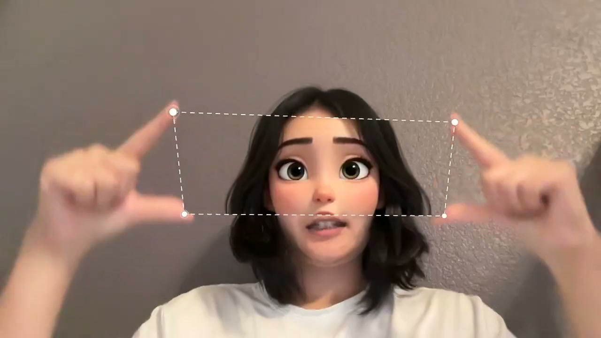
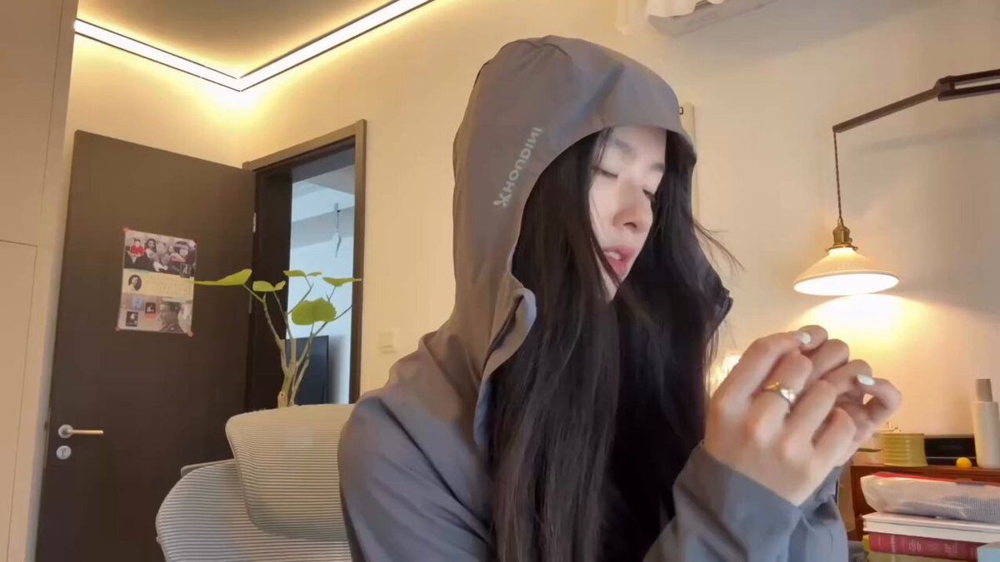
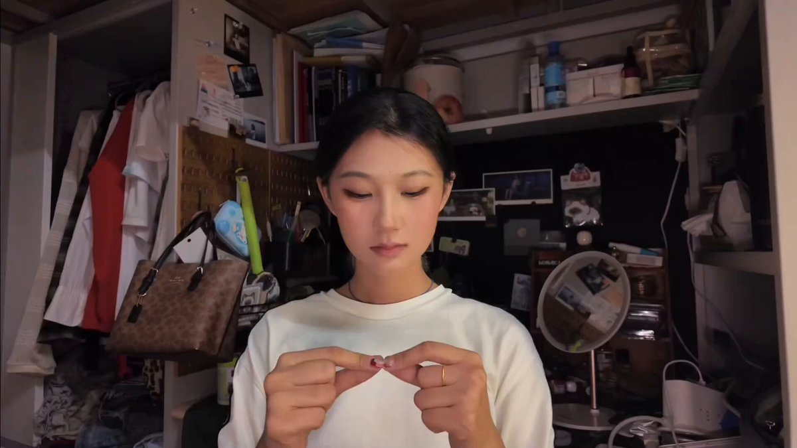
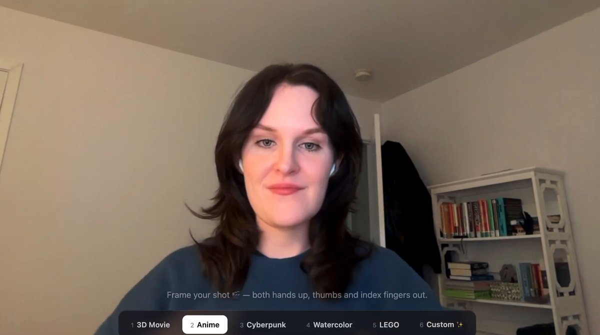

# Finger Frame Effect AI: efecto de marco con los dedos

[English](README.md) · [简体中文](README.zh-CN.md) · [한국어](README.ko.md) · [日本語](README.ja.md) · [Español](README.es.md)

Esta demo de código abierto sigue la ventana formada con las dos manos. MediaPipe detecta las puntas de ambos pulgares e índices y Canvas compone otro vídeo dentro del polígono de cuatro puntos.


## Demo y generación con IA

- [Abrir la demo en español](https://aithink001.github.io/finger-frame-effect-ai/es/)
- [Crear el vídeo final en C Dance AI](https://cdance.ai/es/finger-frame-effect-ai?utm_source=github&utm_medium=readme-es&utm_campaign=finger_frame_ai)

La demo de GitHub procesa el material en la pestaña actual del navegador y permite estudiar el seguimiento, la estabilización de las cuatro esquinas y la composición local. El flujo de C Dance AI edita el vídeo fuente con Gemini Omni y envía instrucciones específicas para conservar persona, manos, movimiento y cámara.

## Vídeos de la tendencia

Pulsa una miniatura para reproducir el vídeo autorizado. Estas referencias documentan la tendencia; no son resultados del repositorio ni datos de entrenamiento.

| Sophia Yang | @panpan_kiwi / @koreanoli |
| --- | --- |
| [](https://aithink001.github.io/finger-frame-effect-ai/examples/sophia-yang-finger-frame-demo-01.mp4) | [](https://aithink001.github.io/finger-frame-effect-ai/examples/viral-korean-finger-frame-demo.mp4) |
| @QingQ77 | @venturetwins |
| [](https://aithink001.github.io/finger-frame-effect-ai/examples/qingq77-original-finger-frame-demo.mp4) | [](https://aithink001.github.io/finger-frame-effect-ai/examples/venturetwins-live-finger-frame-demo.mp4) |

## Ejecución local

```bash
npm install
npm run dev
```

Empieza con un clip de cuatro a ocho segundos, cámara fija y luz frontal uniforme. Mantén ambas manos en plano, separa bien las cuatro puntas y conserva la abertura durante al menos dos segundos. El código usa la [licencia MIT](LICENSE); los vídeos de terceros siguen las condiciones de [ATTRIBUTIONS.md](ATTRIBUTIONS.md).
